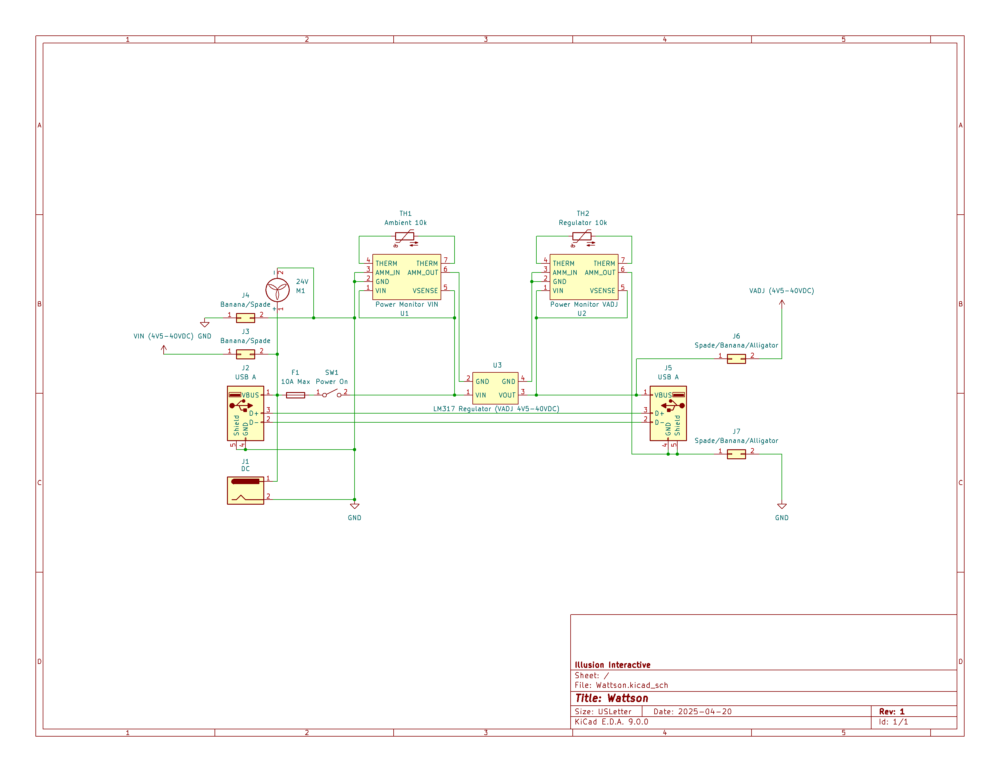

# 💡 Wattson

A simple adjustable **DC voltage regulator** built for powering, monitoring, and protecting a variety of electronics prototyping projects.

---

---

## 🔹 Key Features

- Supports **only one power source at a time** (DC input via banana plugs, spade connectors, jack, or USB-A)
- **10A fuse** for overcurrent protection
- Internal power busses wired with **16 AWG** for ampacity and reduced resistance
- Adjustable voltage output for a broad range of applications

---

## 🔹 Planned Improvements

- Implement a **switchable input selector** for safer handling of multiple power sources
- Add a **USB-A VBUS passthrough** to bypass the regulator when voltage adjustment isn’t needed
- Boost current capacity using **NPN power transistors** in an emitter-follower configuration
